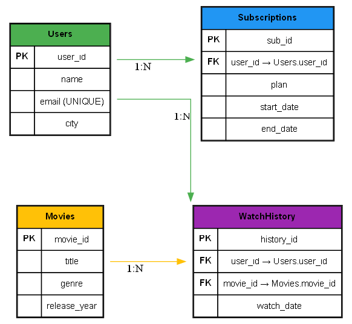

# 🎬 Movie Streaming Platform – Creating Views in SQL

## 📌 Introduction
This project is designed to practice **SQL Views** using a **Movie Streaming Platform** dataset.  
We’ll create reusable views to simplify queries, improve security, and abstract complex logic.

We practice:
- Creating views with `CREATE VIEW`
- Querying data through views
- Using views for abstraction and simplified reporting
- Dropping and updating views

---

## 🚀 How to Run
1. Open **DB Browser for SQLite** (or MySQL Workbench).
2. Create a new database `movies.db`.
3. Run `schema.sql` to create tables.
4. Run `data.sql` to insert sample data.
5. Run `views.sql` to create and test views.

---

## 📂 Files
- `schema.sql` → Database schema (Users, Movies, Subscriptions, WatchHistory)  
- `data.sql` → Sample dataset  
- `views.sql` → Example views & usage queries  
- `docs/er_diagram.png` → ER Diagram  

---

## 📊 ER Diagram

- A **User** has a **Subscription**  
- A **User** watches many **Movies** (via WatchHistory)  
- **Movies** are categorized by genre  

---

## ✅ Outcome
After completing this project, you’ll be able to:
- Create **views** to encapsulate complex queries
- Use views for **abstraction** and **security**
- Query data easily through reusable views
- Manage views with `DROP VIEW` and `CREATE OR REPLACE VIEW`

